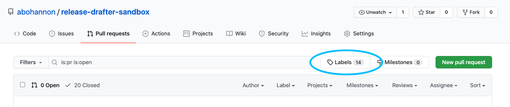
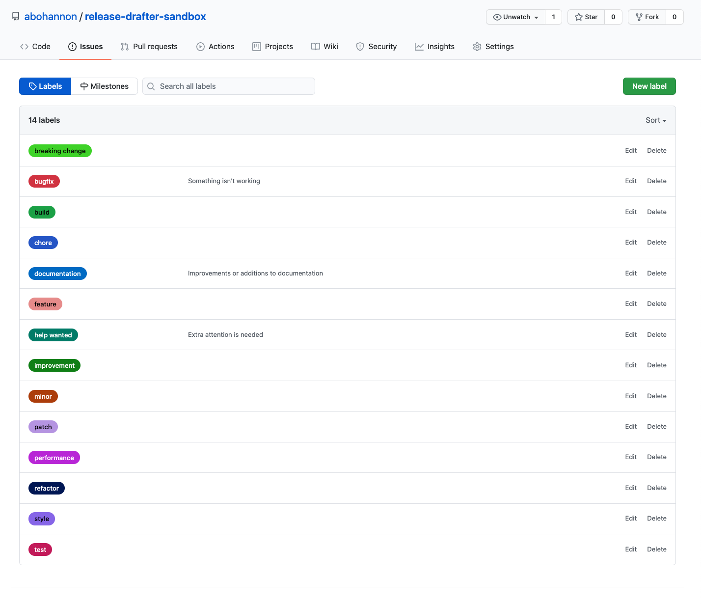
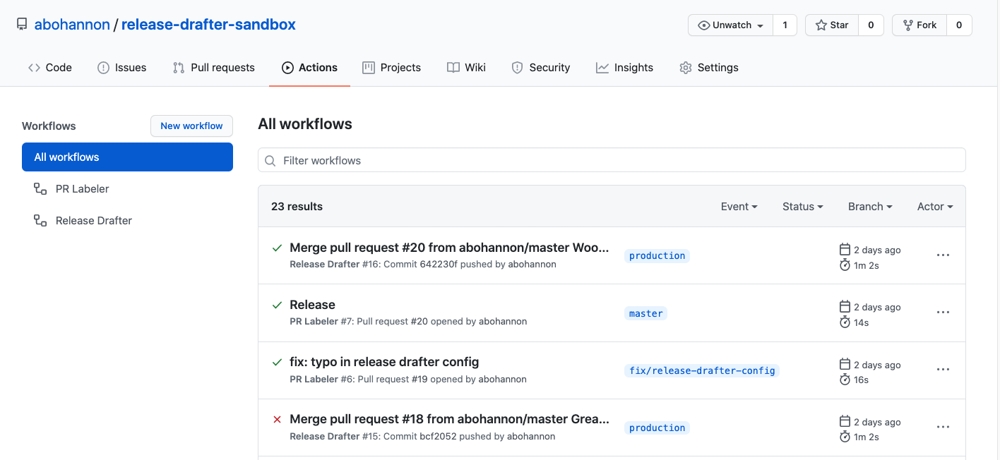
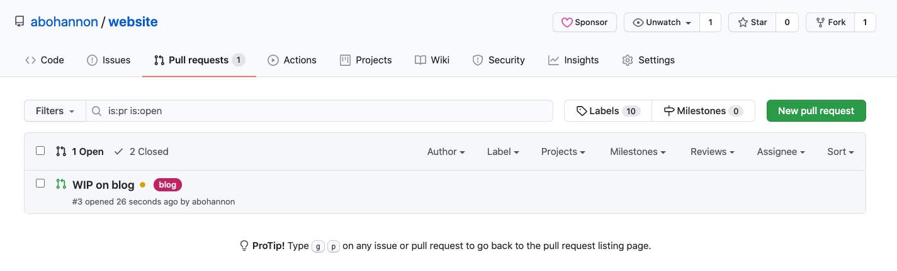
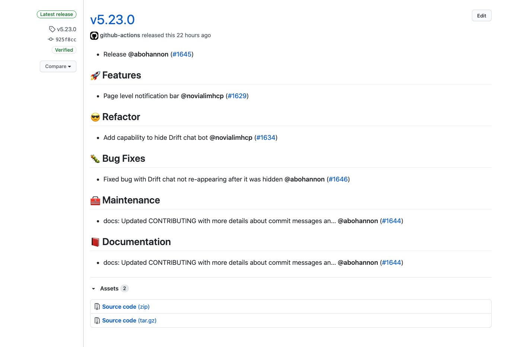

Maintaining a repo, especially one with many contributors, can quickly become overwhelming and disorganized. Though we weren't quite there, a repo I maintain at work was rapidly approaching that cliff so I made a small change to our tooling to strengthen our workflow, improve documentation and generally make our lives easier going forward as the project grows and more engineers inevitably join the project. Fortunately the changes are very easy to make. It should only take you 5-10 minutes.

To handle these problems, I added the following GitHub actions to our repo:

1. [Release Drafter](https://github.com/release-drafter/release-drafter)
2. [PR Labeler](https://github.com/TimonVS/pr-labeler-action)

Prior to adding these actions, we were releasing manually and trying to organize PRs by naming conventions in the title. This has limitations for multiple reasons.

First, releasing manually is tedious and repetitive which means it should probably be automated.

Second, it's prone to human error and laziness. I'll be the first to admit I've written poor release notes because I was busy or distracted. Another reason to automate. This second point can also apply to version bumping. We loosely follow [semantic versioning](https://semver.org/) and probably bump versions inconsistently. At the end of the day, maybe this isn't a huge deal. It's really not for our project but, in the spirit of well-organized software, it's something I wanted to nail down. That's also another great feature of Release Drafter, you can automate version bumping based on PR labels.

Third, relying on organizing PRs by manual naming conventions in the title suffers from these first two problems. It's repetitive and not everyone remembers to do it the same way so it makes the PR view and logs messy. It's also difficult at first glance to get a snapshot of what's currently being worked on. With labels (and if you use different colors like we do), this becomes easier.

## PR Labeler Setup

We'll start with PR Labeler which automatically labels your PRs based on a config.

1. Create and checkout a branch called 'feature/pr-labeler` (this name will come in handy later)
2. Create the folder `.github` in your project's root directory
3. Add a subfolder inside named `workflows`
4. Create a file named `pr-labeler.yml` and paste the following config inside (checkout [the repo](https://github.com/TimonVS/pr-labeler-action) if you have additional questions beyond these instructions)

   ```yml
   name: PR Labeler
   on:
     pull_request:
       types: [opened]

   jobs:
     pr-labeler:
       runs-on: ubuntu-latest
       steps:
         - uses: TimonVS/pr-labeler-action@v3
           with:
             configuration-path: .github/pr-labeler.yml # optional, .github/pr-labeler.yml is the default value
           env:
             GITHUB_TOKEN: ${{ secrets.GITHUB_TOKEN }}
   ```

5. In the `.github` root directory (not inside `workflows`) add another filed named `pr-labeler.yml` and paste the following as a boiler plate.

   ```yml
   feature: ["feature/*", "feat/*"]
   bugfix: ["fix/*", "bugfix/*"]
   style: style/*
   documentation: docs/*
   performance: ["perf/*", "performance/*"]
   refactor: refactor/*
   test: ["test/*", "testing/*"]
   build: build/*
   improvement: improvement/*
   chore: chore/*
   ```

   This configuration is for our repo at work, but the syntax is `<label name>: <branch name>`. The glob `*` at the end indicates that anything after the `/` should match.

   Feel free to change this according to your needs, but for the sake of this tutorial please keep `feature: ["feature/*", "feat/*"]`.

6. Add labels to match your config (if you don't them yet)

   
   

7. Commit, push, and open a PR for your branch

   Now GitHub will see the files you added in the `.github` directory, install the action, and run it. If you click on "Actions" in your repo's top navigation, you can see the action working. This page will show a history of all your actions complete with logs if something goes wrong.

   

   Once the action completes and (hopefully) is successful, head over to your PR view and you should see your PR with the label "feature" next to it. Congrats, you've successfully automated PR labeling!

   I added PR Labeler to my website repo while working on this blog. Here you can see my PR was automatically labeled "blog" because my branch name is `blog/release-tooling` and my yml config includes `blog: blog/*`.
   

## Release Drafter Setup

The Release Drafter setup is very similar to the steps we just went through.

1. In the `.github/workflows` directory you created, create a file named `draft.yml` and paste the following

   ```yml
   name: Release Drafter

   on:
     push:
       branches:
         - master # your production branch

   jobs:
     update_release_draft:
       runs-on: ubuntu-latest
       steps:
         - uses: release-drafter/release-drafter@master
           env:
             GITHUB_TOKEN: ${{ secrets.GITHUB_TOKEN }}
   ```

2. In the `.github` root directory, create a file named `release-drafter.yml` and paste the following. (Remember to checkout [the Release Drafter repo](https://github.com/release-drafter/release-drafter) for more configuration options.)

   ```yml
   name-template: "v$RESOLVED_VERSION"
   tag-template: "v$RESOLVED_VERSION"
   categories:
     - title: "⚠ Breaking Changes"
       label: "breaking change"
     - title: "🚀 Features"
       label: "feature"
     - title: "😎 Refactor"
       label: "refactor"
     - title: "🚅 Performance"
       label: "performance"
     - title: "🐛 Bug Fixes"
       label: "bugfix"
     - title: "🧰 Maintenance"
       labels:
         - "chore"
         - "build"
     - title: "🧪 Tests"
       labels:
         - "test"
         - "testing"
         - "tests"
     - title: "🌈 Style"
       label: "style"
     - title: "📕 Documentation"
       label: "documentation"
   change-template: "- $TITLE @$AUTHOR (#$NUMBER)"
   change-title-escapes: '\<*_&' # You can add # and @ to disable mentions, and add ` to disable code blocks.
   version-resolver:
     major:
       labels:
         - "major"
         - "breaking change"
     minor:
       labels:
         - "minor"
         - "feature"
     patch:
       labels:
         - "patch"
         - "bugfix"
         - "test"
         - "documentation"
         - "style"
         - "chore"
         - "build"
     default: patch
   template: |
     $CHANGES
   ```

   This config determines what the release draft will look like. This is what we use at work and it creates a release that looks like this:

   
